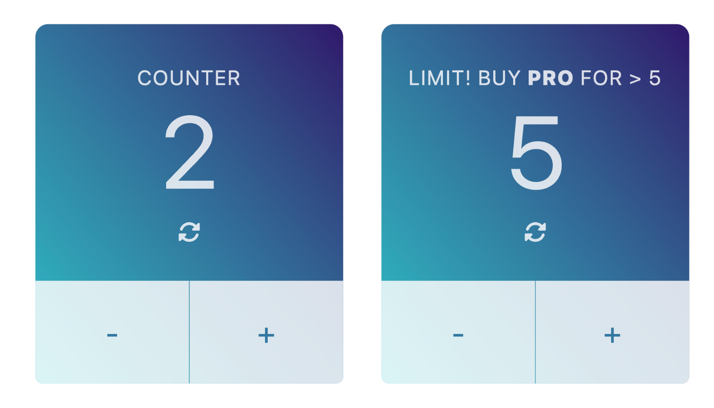

# JavaSrcipt Simple Counter

## Overview

Increase the counter by clicking the "Plus" button and decrease it by clicking the "Minus" button.

To count higher than 5, you must unlock the Pro version. You cannot decrease the counter to less than zero.

You can reset the counter by clicking the refresh icon. A smooth animation will appear.

You can also use the space bar or the cursor control key up to increase the counter and the curser control key down to decrease the counter.

## Screenshot

### Links

- [See live site here](https://thomaserdmenger.github.io/counter-react/)
- [GitHub Repository](https://github.com/thomaserdmenger/counter-react)
- [GitHub Author](https://github.com/thomaserdmenger)